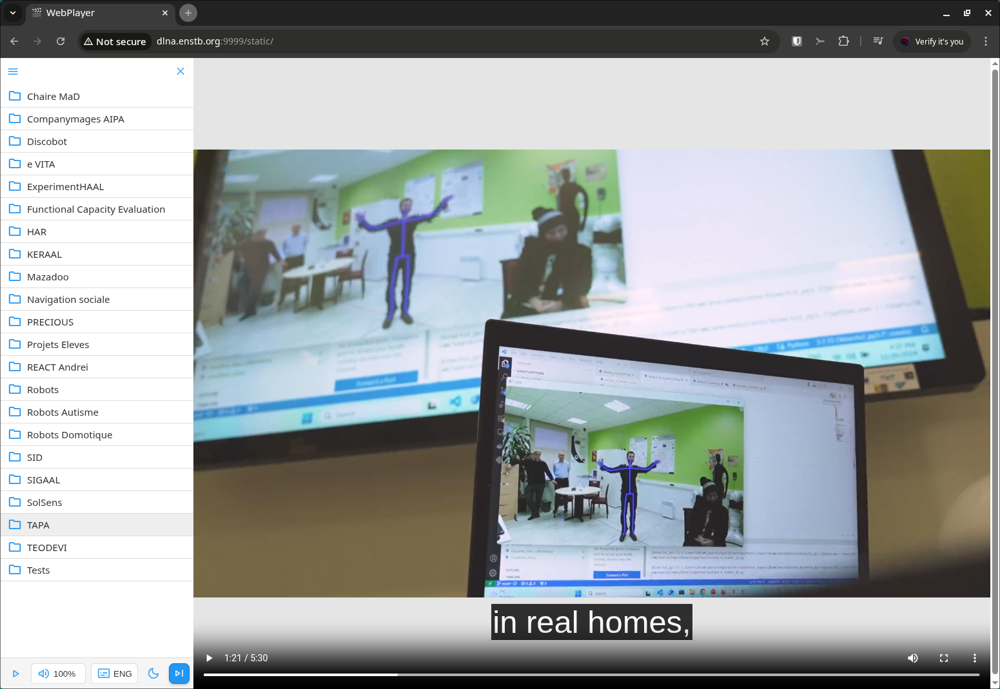

# WallPlayer

WallPlayer is a modern, web-based media player designed for large touch screens and collective spaces. It allows you to browse and play videos from a local or network-mounted directory, with a simple, robust, and touch-friendly interface for big screens.

## Overview



## Features

- **Single binary, zero install**: Everything is included in one statically built executable—no dependencies, no Python, no Node, no database, nothing to install. Just run the binary and you’re ready.
- **Video thumbnails**: Automatic generation and display of video thumbnails for quick visual navigation. [See screenshot](screenshots/2.png)
- **Seamless browsing**: Browse folders and select new videos while a video is playing, without interrupting playback.
- **Subtitle support**: Display and select subtitles (if available) for your videos.
- **Touch-friendly UI**: Optimized for large touch screens and public/shared environments.
- **Instant playback**: Play videos directly in the browser with no extra plugins.
- **Modern stack**: Built with HTMX, Pico CSS, and Go for speed and simplicity.

## Requirements

WallPlayer requires FFmpeg to be installed on your system for video thumbnail generation and subtitle extraction:

```bash
# Ubuntu/Debian
sudo apt install ffmpeg

# macOS
brew install ffmpeg

# Windows (using Chocolatey)
choco install ffmpeg
```

## Configuration

### Videos Directory

By default, WallPlayer creates and uses a `videos` directory in the current working directory. You can change this by setting the `VIDEOS_DIR` environment variable:

```bash
# Set videos directory
export VIDEOS_DIR=/path/to/your/videos

# Run with custom videos directory
VIDEOS_DIR=/path/to/your/videos ./wallplayer
```

## Docker

WallPlayer provides a Docker image for easy deployment. The image includes FFmpeg and runs the application with proper security settings.

### Using Docker Compose

Create a `videos` directory in your project root and place your video files there. The `compose.yaml` file is already provided:

```yaml
services:
  wallplayer:
    image: ghcr.io/jkerdreux-imt/wallplayer:latest
    ports:
      - "9999:9999"
    volumes:
      - ./videos:/app/videos:ro
      - wallplayer_data:/app/data
    environment:
      - PORT=9999
      - VIDEOS_DIR=/app/videos
    restart: unless-stopped

volumes:
  wallplayer_data:
```

Then run:

```bash
docker compose up
```

This will start WallPlayer on `http://localhost:9999` with your videos mounted read-only and persistent data for thumbnails/subtitles.

### Manual Docker Usage

```bash
# Build the image
docker build -t wallplayer .

# Run the container
docker run -p 9999:9999 -v ./videos:/app/videos:ro -v wallplayer_data:/app/data wallplayer
```

The image is also automatically built and pushed to GitHub Container Registry on each commit to the main branch.

## Commands

### Development

To run in development mode:

```bash
go run cmd/main.go
```

### Production

To build the production executable (recommended idiomatic Go command):

```bash
go build -o wallplayer ./cmd
```

To run the executable:

```bash
./wallplayer
```

## License

This project is licensed under the GNU General Public License v3.0 (GPLv3).
See the [LICENSE](LICENSE) file for details.
